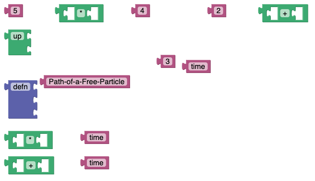

# clj-tiles
## Description
Visual programming for STEM students and instructors at university level.

If you like videos, see my presentation on youtube for the [Visual Tools meeting](https://www.youtube.com/watch?v=m1HbWpWiTk4&t=506s).  
Make sure to interactively follow along: [clj-tiles link to Github pages](https://kloimhardt.github.io/cljtiles.html?page=FDG001).

Being describable as a mixture of Wordle and Scratch, clj-tiles is for every student who, at a young age, has been gotten hooked as a Princess of Science (see the episode with Prof. Johanna Pirker on ZDFtivi).

External links: [ZDFtivi](https://www.zdf.de/kinder/princess-of-science/diy-spielentwicklung-100.html), [STEM](https://en.wikipedia.org/wiki/Science,_technology,_engineering,_and_mathematics), [Scratch](https://scratch.mit.edu), [Wordle](https://www.nytimes.com/games/wordle/index.html)

## Features
* Solve over 100 graphical puzzles in the browser
* Get Wordle inspired feedback
* Live coding in front of an audience made easy
* Learn functional programming to your inner child
* Notice the similarities between coding and writing poetry
* Load more puzzles from the web with the built in parser

## Roadmap
* Out of this documentation, being a conglomeration, make a peer-reviewed journal article
* Migrate to JAX + Python as main engine for calculations
* Prepare a series of lectures on basic algebra
* Do a control group study to assess the efficacy of the lectures
A long-term research goal is the improvement of non-verbal plot building of the visual tutorials.

## Details

### Competence before Comprehension
As an introduction, we start with the following picture which also appears when you click on this [clj-tiles link](https://kloimhardt.github.io/cljtiles.html?org=https://raw.githubusercontent.com/kloimhardt/clj-tiles/master/public/org/sicm-book-vscheme-part1.org).


The picture will not tell you much at first. For fun, you can press the `Run` button. But you also might notice the `Get the Puzzle` button. Press it.


This looks rather complicated, but you start to notice that the content of the graphical blocks are the same as in the first picture. There is `R`, `phi`, `sin` and so on.
As a hint of how to proceed, we show (with arrows) the first steps to complete the puzzle.


After these first steps, you continue...


... and arrive at the following picture. Interesting here is the `Color` button. It indicates that you are on the right track. It is modelled after Wordle. Can you finish the puzzle now? After all, you can look up the solution in the first picture above.


After proving that you finished the puzzle correctly (all code is green), the   `>` button becomes green itself. This means that, when you move to the next page, you already get the solution to that next puzzle.

So you need to solve a puzzle to get the solution of the next. But if you watch the video mentioned at the beginning, you will find out the trick how to see all puzzles solved without any work. On the other hand, the `Shuffle` button makes it all much harder.

### Comprehension of the Domain
The above example is known to any high school student: conversion of polar coordinates (`R` and `phi`) to the usual rectangular ones.

But this is just a start. By completing all the puzzles of this visual tutorial, a Physics student in the 3rd semester can learn Classical Mechanics. Indeed she first gets competent by solving the puzzles, maybe just learning them by heart. Then, she will gain a much deeper comprehension when reading more carefully the book "Structure and Interpretation of Classical Mechanics".

clj-tiles is perfect for all STEM domains. Given my background, mathematical finance comes to mind. Indeed, the examples shown in the video above are pure mathematics (from the book "Functional Differential Geometry").

Admittedly, the learning curve of these two books is very steep. That is way I created a somewhat simpler physics tutorial with my own descriptions and also hand-crafted puzzles (click [here](https://kloimhardt.github.io/cljtiles.html?page=116)).

This set of tutorials also contains the simplest chapter of all: completing Bob Dylan lyrics. This shows that the scope might be broader than STEM. This was also the chapter I opened my talk with at the reClojure conference of 2021 (see [this youtube playlist](https://www.youtube.com/playlist?list=PLchX49hOw0Gapr28Gs4yUmJkuJWaRYXMn)).

External links: [Structure and Interpretation of Classical Mechanics](https://mitp-content-server.mit.edu/books/content/sectbyfn/books_pres_0/9579/sicm_edition_2.zip/chapter001.html), [Functional Differential Geometry](https://mitpress.mit.edu/books/functional-differential-geometry).

### Teaching
clj-tiles is suited for not only learning but especially also teaching STEM. Live coding in front of an audience is made easy. The instructor just prepares puzzles and solves them in front of the audience. Typos like in editor based live coding are impossible. Students can follow along in real-time on their own computers.

In the literature this method of learning and teaching is known as Parsons puzzle. With this, teaching itself becomes a subject of an interdisciplinary sociological study. Questionnaires and Control Groups can be used for assessing the efficacy of the method.

I tried to explain this more in a very preliminary draft of a [paper on visual programming](https://github.com/kloimhardt/werkbank/blob/master/latex/ga_pro_kla_mech.pdf).

External link: [Parsons puzzle](https://en.wikipedia.org/wiki/Parsons_problem)

### JAX and Functional Programming for the Win
The tutorials as well as the implementation of clj-tiles are based on Clojure, a functional programming language from the LISP family. Indeed, many tutorials in clj-tiles are for learning this splendid language, starting with .

Clojure is a niche language, as opposed to the very popular Python. I tried to show the advantages of the functional notation for STEM (compared to common Python syntax) in a [preprint on how to design a functional interface](https://arxiv.org/abs/2312.13295).

However, recently there has been introduced a Python library which rapidly gains popularity, namely JAX: "the kinds of program transformations that JAX enables are much more feasible in functional-style programs". Casually said, JAX is Clojure bolted onto Python.

The blocks of clj-tiles are meant to exclusively represent a functional notation. This is the all important difference between clj-tiles and the visual building tools Scratch and BlockPy.

The other main difference is that clj-tiles is not meant for building programs but for understanding already existing code.

JAX+Python opens up a fruitful future path for clj-tiles. It is perfectly feasible, via the Hy language, to generate JAX syntax out of the already existing block notation. In this way, STEM students are introduced to functional notation without any distraction.

External link: [Clojure](https://www.clojure.org), [BlockPy](https://think.cs.vt.edu/blockpy/) [JAX](https://jax.readthedocs.io/en/latest/jax-101/01-jax-basics.html#differences-from-numpy), [Hy](http://hylang.org)

### Gamification
In interactive experiences, points and achievements are not attributes of Gamification but hollow structures without content. To me, under the influence of Jon Blow and his game "The Witness", gamification is about non-verbal plot building, encouraging mimicry and providing immediate feedback. The hand-crafted puzzles mentioned above are testimony to this.

Also, inspired by talking chess computers, text- and point-and-click adventure games, I experimented with the "inspect" feature of clj-tiles. The according interactive workspace appears when you click on this [clj-tiles link](https://kloimhardt.github.io/cljtiles.html?page=freeparticle).


As this workspace is not yet self explanatory, I provide a [walkthrough video](https://www.youtube.com/watch?v=DHcZkmXKp04).

External link: [Jon Blow on youtube](https://www.youtube.com/watch?v=qWFScmtiC44), [Scarlett adventure](https://games.zuderstorfer.com/Adventure_1_en.html)

## Parser, Execution and Block Inspection

By pressing the `Run` button, the workspace is executed.

You can inspect the blocks by right clicking on them. The workspace is executed and the result of the expression represented by the according block is displayed. Along with the result, the type of the data is indicated.

You can load a new tutorial from the web. Open the parser by right clicking on a white space. Select a tutorial in the drop down menu: a URL appears in the text field. Press insert.

There is also a more direct way to create new puzzles. Paste the following code into the text field:

```
(sort [2 1 3])
```

More on the parser can be found in the

## Technical Details
which are in [this document](screenshots/technical_details.md).

[GPL v3](LICENSE) Copyright © 2021 Markus Kloimwieder
