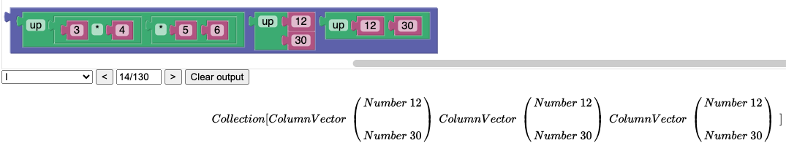

# Technical Details
[back to main document](../README.md)

## Link Index
### Sussman books
* [Structure and Interpretation of Classical Mechanics (SICM)](https://mitp-content-server.mit.edu/books/content/sectbyfn/books_pres_0/9579/sicm_edition_2.zip/chapter001.html), ([main page](https://mitpress.mit.edu/sites/default/files/titles/content/sicm_edition_2/book.html), [reprint](https://tgvaughan.github.io/sicm/))
* [Functional Differential Geometry (FDG)](https://mitpress.mit.edu/books/functional-differential-geometry)

### clj-tiles workspaces
* [Visual Geometry](https://kloimhardt.github.io/cljtiles.html?page=FDG001): examples from FDG book, auto generated puzzles, solutions available
* [Visual Algebra](https://kloimhardt.github.io/cljtiles.html?org=https://raw.githubusercontent.com/kloimhardt/clj-tiles/master/public/org/sicm-book-vscheme-part1.org): examples from SICM book, only first three workspaces executable, auto generated puzzles, solutions available
* [Visual Motion](https://kloimhardt.github.io/cljtiles.html?page=116): Chapter "Driven Pendulum": hand crafted puzzles, solutions available; Other chapters, including "Bob Dylan lyrics" and "Hello, World!": hand crafted puzzles, no solutions
* [Visual Interaction](https://kloimhardt.github.io/cljtiles.html?page=freeparticle): prototype of interactive dialogue

## Parser
Open the parser by right clicking on a white space. Select a tutorial in the drop down menu: a URL appears in the text field. Press `insert`. You just loaded a new tutorial from the web.

The URL in the text field can be changed, so you can provide your own files (they need to follow the format of the provided tutorials).

However, there is a more direct way to create new puzzles. Paste the following code into the text field:
```
{:blockpos [[0 0] [0 100] [0 170] [100 170] [0 220]]
 :code [(:tiles/vert {:title "Getting Clojure"
                      :author "Russ Olson"
                      :published 2018})
        (def :tiles/slot :tiles/slot)
        book
        book
        (:published :tiles/slot)]}
```

Or paste:
```
{:blockpos []
 :code [(def book
        {:title "Getting Clojure",
         :author "Russ Olson",
         :published 2018})
        (:published book)]}
```
Or paste:
```
(:author book)
```
Notice that in the simplest last case, the workspace is not cleared before insert.

If you create a puzzle with the code,
```
[(up (:tiles/infix (* 3 4)) (* 5 6)) (:tiles/vert (up 12 30)) (up 12 30)]
```
upon `right-click-inspect` you will see the following picture:




This shows that the arrangement of the blocks, whether vertical or horizontal, is just a visual feature which does not affect the result of the executed program. Also infix or prefix notation for basic math like multiplication `*` has no effect in that respect. In any case, the button `Get the Puzzle` in the current implementation does not preserve visual formatting but reverts to the default horizontal prefix visualisation.

The file [book_examples_1.cljs](https://github.com/kloimhardt/clj-tiles/blob/master/public/org/book_examples_1.cljs) contains code from the [SICMutils Jupyter notebook](https://github.com/sicmutils/sicmutils/blob/master/jupyter/book-examples.ipynb). It can be readily pasted into the clj-tiles parser. Reading the first pages of the SICM book is mandatory for understanding.

## A kind note on types and the role of graphical blocks

You can inspect the blocks by right clicking on them. The type of the according data is displayed as the program is running.

Like in the physical world, where things are of some kind or another (like sheep, cow, electron), within programs, many types of things appear as well: vectors, functions, numbers, symbols and their combinations, mathematical expressions. There is an infinite number of types, as programmers invent them all the time. E.g. the data holding the address of a person can be attributed the type "collection of strings" or even "address" or both, depending on software design.

Within the [SICMutils](https://github.com/littleredcomputer/sicmutils) library (and according clj-tiles tutorial), programs codify physical theories. It is helpful to identify and show types along with the data. So the different things can be recognised properly. Things that admittedly do not exist in the city of Vienna but are abstract things of aesthetic experience. Things that in any case act back on the physical world in laboratories and technical applications. Things like a mathematical expression containing the rule to calculate the orbital angular momentum of a satellite in space.

The blocks are attempts to picture those things, comparable to drawings and figures of [Santa Claus](https://en.wikipedia.org/wiki/Yes,_Virginia,_there_is_a_Santa_Claus). A block has a graphical appearance and can be moved around on the workspace. But while its appearance does not change, one and the same block can result in different things during the process of a running program. Thus, to complete the picture it is necessary to be able to display the types and data the blocks result into during the execution of the program.

The way in which the theory of classical Mechanics makes new things appear can be found out by playing with them. By combining and inspecting the graphical blocks. This hopefully leads to a deeper understanding of the theory. After having understood the theory and the places of things, the display of types will not be necessary anymore as the user develops her own sophisticated picture. The final goal is to be able to read, grasp, modify and run sophisticated code examples displayed in a text editor.

## Setup

For development install Clojure/Java and Node and do:
 ```
 npm init -y
 npm install --save-dev shadow-cljs
 npm install blockly
 npm install sax
 npm install odex
 npm install complex.js
 npm install fraction.js
 npm install mathjax@2

 shadow-cljs watch cljtiles
 ```
 then open `http://localhost:8080/cljtiles.html` in your browser.

## Related projects
* [ClojureBlocks](https://codeberg.org/jhandke/ClojureBlocks)
* [Blockly](https://developers.google.com/blockly)
* [BlockPy](https://think.cs.vt.edu/blockpy/)
* [blockoid](https://github.com/ParkerICI/blockoid)
* [Werkbank](https://github.com/kloimhardt/werkbank)
* [sicmutils](https://github.com/sicmutils/sicmutils)
* [SCI](https://github.com/borkdude/sci)

[back to main document](../README.md)
